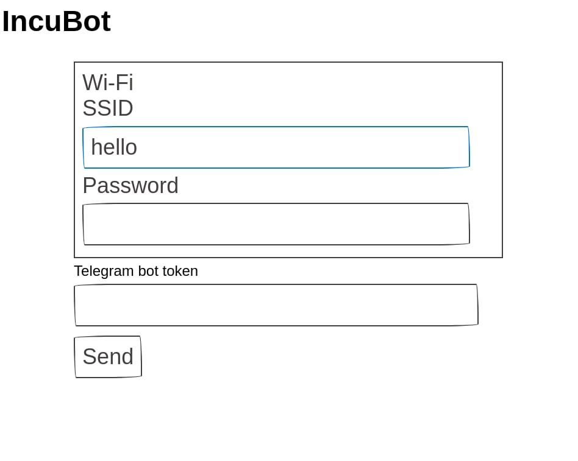

# IncuBot

Minimal form for embedded system



-   Paper style
-   Works without internet connection (internal network)
-   Size under 1000 bytes

## Dependencies

-   NodeJS

## Build

```bash
npm run prod
```

Then you can find compiled files in `dist/`

## Test

```bash
./test
```

Checks file size under 1000 bytes
