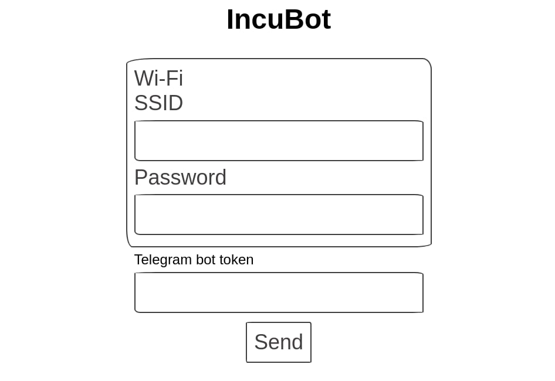

# IncuBot

Minimal form for embedded system

[Live Preview](https://ulcuber.github.io/incu-bot/)




Elinks:


-   Paper style
-   Works without internet connection (internal network)
-   Only 1002 bytes

## Dependencies

-   NodeJS

## Build

```bash
npm run prod
```

Then you can find compiled files in `dist/`

## Usage

Take `dist/index.html` after build

Replace `display: none;` to show error message

## Test

```bash
./test
```

Checks file size under 1010 bytes
